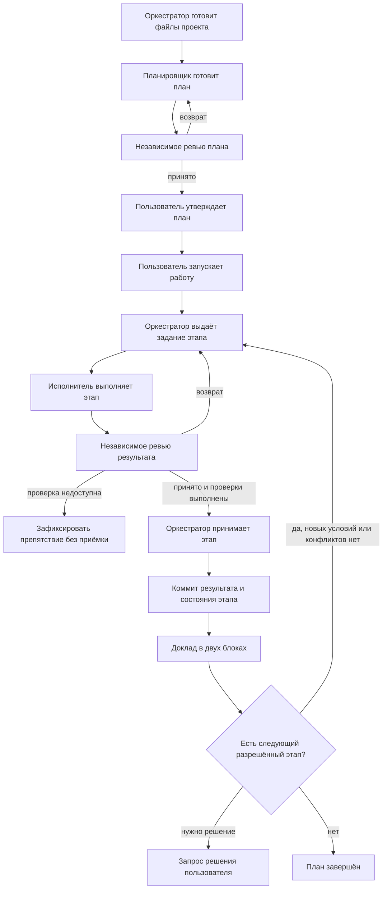

# AI-Orchestrated Workflow

Четыре навыка для ведения задач в Claude Code, Codex и Antigravity: подготовка плана, выполнение по одному этапу и независимое ревью. Репозиторий содержит устанавливаемые навыки и примеры файлов проекта.

## Установка

Скопируйте четыре каталога из `skills/` в `~/.agents/skills/`. На Windows из корня этого репозитория:

```powershell
$workflowSkillRoot = Join-Path $env:USERPROFILE '.agents/skills'
New-Item -ItemType Directory -Force -Path $workflowSkillRoot | Out-Null
foreach ($role in 'orchestrate', 'planner', 'implementer', 'reviewer') {
    Copy-Item -LiteralPath "skills/$role" -Destination $workflowSkillRoot -Recurse -Force
}
```

На macOS и Linux:

```sh
mkdir -p ~/.agents/skills
cp -R skills/orchestrate skills/planner skills/implementer skills/reviewer ~/.agents/skills/
```

Antigravity читает глобальные навыки из `~/.gemini/config/skills/` и не читает `~/.agents/skills/`; ссылки-соединения (junction) на каталоги он не открывает. Для Antigravity скопируйте те же четыре каталога и туда. Навыки с `disable-model-invocation: true` Antigravity не предлагает модели сам, но загружает по явной команде `/<имя навыка>`, в том числе в неинтерактивном режиме `agy -p`.

Claude Code читает файлы вне рабочих каталогов только с разрешения. В сессиях без диалога (`claude -p`, подагенты) запрос разрешения не показывается и чтение отклоняется, поэтому в настройках проекта или профиля разрешите чтение комплекта: `"permissions": { "allow": ["Read(~/.agents/skills/**)"] }`.

При обновлении сначала сравните установленные файлы с исходниками и сохраните локальные изменения. Изменённый исходный комплект проходит независимое ревью до установки; проверяются связанные навыки, формы состояния, шаблоны и затронутые проектные привязки. После положительного ревью перенесите проверенную версию, сверьте хеши файлов и начните новую сессию. Обрыв ревью не подтверждает готовность комплекта. Пользовательские метаданные навыков сохраняются.

| Навык | Работа |
|---|---|
| `orchestrate` | Готовит файлы workflow проекта, ведёт план, выдаёт задания и принимает проверенные этапы. |
| `planner` | Готовит или пересматривает план; исполнение не запускает. |
| `implementer` | Выполняет один этап по текущему заданию. |
| `reviewer` | Независимо проверяет план, инструкции или результат этапа. |

## Создание плана

Откройте сессию в нужном проекте. В Codex используйте `$orchestrate`:

```text
$orchestrate Создай план <имя-плана>. Цель: <результат>. Исполнение не запускай.
```

Для первого подключения в Claude Code отправьте обычное текстовое поручение:

```text
Прочитай ~/.agents/skills/orchestrate/SKILL.md и действуй по нему. Создай план <имя-плана>. Цель: <результат>. Исполнение не запускай.
```

После подключения используйте `/orchestrate` вместо `$orchestrate` в командах ниже; в Antigravity — тоже `/orchestrate`.

Навыки устанавливаются в общий профиль и используются в разных проектах. Протокол и референсы остаются в установленном комплекте. Оркестратор создаёт только требуемые для проекта файлы: одну привязку `orchestrate_workflow/method.md`, недостающий контракт и определения используемых ролей, материалы конкретного плана и текущий обмен. Каталог `orchestrate_workflow/references/` и копии метода в каталогах планов или сессий не создаются; повторное подключение не создаёт дублей.

Оркестратор сам создаёт отсутствующие каталоги и необходимые файлы по [правилам подключения](skills/orchestrate/references/project-files.md): контракт, привязку путей, определения ролей и локальный обмен. Существующие файлы читает и сохраняет; конфликтующие настройки согласует. Самостоятельно писать метод, заготовки ролей и папки пользователю не требуется.

Planner нужен для нового плана и существенного пересмотра цели, этапов, зависимостей, границ или критериев. Статус, восстановление и небольшие правки оркестратор выполняет сам. Пользователь задаёт работу в диалоге; нужные роли вызывает оркестратор. План проверяет reviewer, утверждает пользователь. Подготовка проекта и утверждение плана не запускают реализацию.

## Общая схема работы



Исполнитель и reviewer работают в отдельных контекстах. Оркестратор ведёт один этап за раз и сохраняет его исходную точку. Утверждение плана и запуск работы имеют разный смысл; их можно дать в одном ясном поручении после ревью. Запуск включает коммиты принятых этапов и переход между ними без повторных разрешений. Явные ограничения пользователя сохраняются; push разрешается отдельно.

## Модели ролей и поставщики

Оркестратор является **модель-агностиком**: сессия оркестратора может быть запущена в любой среде разработки (Google Antigravity, Claude Code, OpenAI Codex). Поставщик модели (Anthropic, OpenAI, Google) и модель роли выбираются при составлении плана или в начале новой сессии.

### Варианты назначения модели

| Вариант | Как задаётся |
|---|---|
| Модель сессии | Роль наследует поставщика и модель текущей сессии (по умолчанию). |
| Другая модель того же поставщика | Оркестратор задаёт модель параметром вызова (`claude -p --model`, `codex exec -m`, `agy -p --model`). |
| Модель другого поставщика | Оркестратор вызывает внешний инструмент в корне проекта (`claude -p`, `codex exec`, `agy -p` или `gemini -p`). |

### Специализация задач по поставщикам

Матрица задач на основе сильных сторон моделей:

| Задача / Область | Рекомендуемый инструмент и модель | Сильная сторона / Почему |
|---|---|---|
| **Мультиагентная оркестрация и комплексные фичи** | Любая среда (модель-агностик); при запуске в Antigravity — Gemini 3.8 Flash / встроенные Claude 5.5, GPT-OSS | Параллельный запуск субагентов, единое окно артефактов, мультимодельный селектор, фоновые задачи. |
| **Сложный рефакторинг кода и критические модули** | OpenAI / Anthropic: GPT-6 Astra / Claude Opus 5.5 (для модульного: Sonnet 5.5) | Максимальная глубина рассуждений для архитектурных перестроек и критических модулей. |
| **Анализ тяжелых регламентов Минздрава / НСИ / большие дампы логов** | Google: Antigravity / Gemini CLI (Gemini 3.8 Flash / 3.1 Pro) | Огромный контекст (1M+ токенов): регламенты ЕГИСЗ и схемы СЭМД помещаются целиком без обрезки и потери связей. |
| **Глубокий алгоритмический анализ, оптимизация сложных SQL/PL-pgSQL** | OpenAI: Codex / ChatGPT (GPT-6.1 Sol / GPT-6 Astra) | Лучшая цепочка рассуждений (Reasoning) для нестандартной математики, планов запросов (EXPLAIN ANALYZE) и оптимизаций. |
| **Финальная вычитка документации и статей (Docusaurus / Вики)** | Anthropic: Claude Code (Claude Sonnet 5.5 / Haiku 4.5) | Чистый технический язык без траты дорогой квоты флагманских моделей (Opus/Astra). |

### Особенности запуска инструментов (включая Windows)

- **Windows PowerShell**: внешние CLI вызываются с закрытым потоком ввода (`$null | claude -p ...`, `$null | codex exec ...`, `$null | agy -p ...`, `$null | gemini -p ...`), исключая зависания. Отчёты сохраняются строго в кодировке UTF-8 без BOM.
- **Инструменты Google**:
  - `agy -p` (Antigravity CLI): авторизация через Google Account (`oauth_creds.json`), поддержка `--mode` и уровня рассуждений `--effort <low|medium|high>`.
  - `gemini -p` (Gemini CLI): работа через API Key или Vertex AI (ADC), поддержка доверия каталогу (`trustedFolders.json` или `GEMINI_CLI_TRUST_WORKSPACE=true`) и `--approval-mode auto_edit`.

### Цепочка альтернатив при лимитах и недоступности моделей

Если у выбранного поставщика исчерпан лимит квоты (HTTP 429, Insufficient Quota), превышен контекст или инструмент недоступен, оркестратор применяет каскадный шаблон альтернатив:

`Основная модель (Primary) -> Резерв 1 (Alternative 1) -> Резерв 2 (Модель сессии)`

| Специализация | Основная модель | Резерв 1 | Резерв 2 (Модель сессии) | Стратегия компенсации (Degraded Mode) |
|---|---|---|---|---|
| **Сложный рефакторинг** | GPT-6 Astra / Claude Opus 5.5 | Claude Sonnet 5.5 / GPT-6.1 Sol | Модель сессии | Обязательный запуск исполнителем строгих линтеров, компилятора и тестов с фиксацией кодов выхода в отчёте. |
| **Вычитка документации** | Claude Sonnet 5.5 | Google Gemini 3.8 Flash / Haiku 4.5 | Модель сессии | Системный промпт со словарём терминов (ЕГИСЗ, РЭМД, ИЭМК, СЭМД, МО, НСИ) и правилами исключения переводных калек. |
| **Алгоритмы и SQL/PL-pgSQL** | OpenAI GPT-6.1 Sol / GPT-6 Astra | Claude Sonnet 5.5 (с высоким reasoning) / Gemini 3.8 Flash | Модель сессии | Принудительная пошаговая декомпозиция (Chain-of-Thought) в промпте: сбор плана `EXPLAIN ANALYZE`, проверка инвариантов. |
| **Тяжелые регламенты и логи** | Gemini 3.8 Flash (High effort) / 3.1 Pro | Claude Sonnet 5.5 / GPT-6.1 Sol | Модель сессии | Предварительная селективная фильтрация и чанкование данных оркестратором до вызова роли при меньшем окне контекста. |

Переход на резерв не блокирует этап. Факт замены, причина и применённая компенсация фиксируются в `result.md` и в итоговом докладе оркестратора («Как сейчас»).

## Ответ по итогу этапа

Два блока по [общей форме](skills/orchestrate/references/templates.md#ответ-по-итогу-этапа):

1. «Как сейчас» → таблица `№ | что | как` → «Нужно ваше решение». В отчёте указаны состояние и коммит, изменения, проверки, непроверенное с причинами, риски и следующий этап. Когда решение не требуется, оркестратор пишет «Не требуется» и продолжает работу.
2. Вики-сводка в Textile: текущий результат и фактические проверки, без истории обсуждения.

## Как вести сессию

После положительного ревью подтвердите план обычной репликой в диалоге. Отдельная команда утверждения не нужна. Если в той же реплике явно разрешён запуск, повторять поручение не требуется.

Для запуска утверждённого плана:

```text
/orchestrate Запусти утверждённый план <имя-плана>. Push запрещён.
```

Для новой сессии или продолжения (без диалога — `claude -p "<команда>" --model <модель>`: без `--model` используется модель инструмента по умолчанию, а не модель сессии приложения):

```text
/orchestrate Продолжи запущенный план <имя-плана>. Сначала сверь материал плана, git, задание, отчёт и ревью.
```

Для проверки плана без выполнения:

```text
/orchestrate Сводка плана <имя-плана>. Исполнение не запускай.
```

Оркестратор сверяет всё поручение с фактом до первого задания, сохраняет разрешения пользователя и выполненные операции. Затем выдаёт один `spec.md`; исполнитель приносит `result.md`, reviewer — `review.md`. Возврат исправляется в том же этапе. Ревью относится к точной версии файлов; после его проверки результат и приёмка фиксируются одним коммитом, если пользователь явно не запретил коммиты. При запрете записываются приёмка без коммита, причина и проверенная версия файлов. Оркестратор докладывает итог и сразу продолжает следующий разрешённый этап; неуспешный разрешённый коммит останавливает переход. Вопросы задаются только при новых условиях или конфликтах, требующих решения пользователя. Отмена, ошибка или лимит оставляют явную точку восстановления.

| Что | Где в проекте |
|---|---|
| Пути и отклонения проекта | `orchestrate_workflow/method.md` |
| Статус, цель и очередь плана | `orchestrate_workflow/plans/<план>/00_summary.md` |
| Решения, этапы и их состояние | `orchestrate_workflow/plans/<план>/<задача>.md` |
| Текущие задание, отчёт и ревью | `orchestrate_workflow/<план>/spec.md`, `result.md`, `review.md` — локально, вне git |

Подробности находятся в навыках: [протокол](skills/orchestrate/references/protocol.md), [восстановление](skills/orchestrate/references/session-start.md), [шаблоны](skills/orchestrate/references/templates.md). Предметные правила и проверки задаёт контракт проекта. Каталог текущей сессии не служит второй копией плана.
