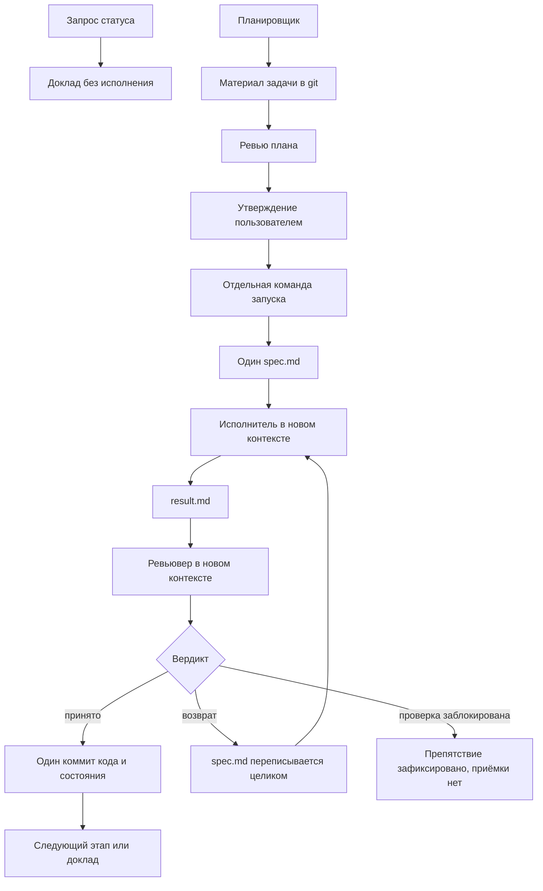

# AI-Orchestrated Workflow

Guideline and skills for running a coding plan with AI agent (Claude Code/Codex): one orchestrator session, one stage at a time, an independent review, and a single place where the plan state lives.

Пользователь утверждает план и отдельно разрешает запуск. Оркестратор не исполняет этап сам. Исполнитель делает один этап по единственному заданию. Ревьювер проверяет результат в новом контексте. Принятый этап вместе с его состоянием фиксируется одним коммитом. Всё, что должно пережить сессию, лежит в git; локально хранится только текущий обмен трёх файлов.

## Зачем так

Длинная сессия агента теряет уже принятые решения, заводит вторую копию плана и принимает этап, который ревью вернуло. Этот комплект оставляет один протокол и четыре роли с разными правами.

- Состояние этапа одно и находится в материале задачи под git.
- Действующее задание одно: локальный `spec.md`. Копий будущих заданий нет.
- Статус, утверждение и запуск — разные команды. Отчёт о статусе работу не начинает.
- Возврат ревью нельзя превратить в приёмку, перенеся замечания на следующий этап.
- Отказ среды сообщается буквально и не подменяется новым запросом разрешения у пользователя.

## Роли

| Роль | Когда | Чего не делает |
|---|---|---|
| Планировщик | Новый план или существенный пересмотр | Не запускает исполнение |
| Оркестратор | Явная команда вести, запустить или продолжить план | Не пишет код этапа и не коммитит непринятое |
| Исполнитель | Один этап, новый контекст | Не коммитит и не правит инструкции и план |
| Ревьювер | План до утверждения и каждый этап после исполнения | Не коммитит и не ослабляет критерии |

Все роли наследуют модель текущей сессии. Своя модель в определении роли не задаётся. Исполнители одного плана идут по очереди: параллельно этапы не ведутся.

## Как идёт сессия



Команда продолжения не открывает новые существенные решения. Их сначала показывают пользователю и записывают в материал задачи.

Подробный порядок — в [протоколе](skills/orchestrate/references/protocol.md). Восстановление оборванной сессии — в [начале сессии](skills/orchestrate/references/session-start.md).

## Где лежит состояние

Проект может назвать другой каталог плана. Второго каталога рядом не появляется.

| Что | Где | Git |
|---|---|---|
| Очередь и ссылки | `plans/<план>/00_summary.md` | да |
| Цель, решения, этапы, критерии, состояние | `plans/<план>/<задача>.md` | да |
| Привязка путей проекта | `orchestrate_workflow/method.md` | да |
| Задание | `orchestrate_workflow/<план>/spec.md` | нет |
| Отчёт исполнителя | `orchestrate_workflow/<план>/result.md` | нет |
| Ревью | `orchestrate_workflow/<план>/review.md` | нет |

Очередь не копирует этапы. Локальный обмен перезаписывается. Утверждённое решение не остаётся только в чате. Подкаталоги обмена не коммитятся:

```gitignore
/orchestrate_workflow/*/
```

## Навыки

| Навык | Назначение |
|---|---|
| [orchestrate](skills/orchestrate/SKILL.md) | Ведёт явно запущенный план. Сам не вызывается. |
| [planner](skills/planner/SKILL.md) | Готовит или существенно пересматривает план. |
| [implementer](skills/implementer/SKILL.md) | Делает один этап по `spec.md`. |
| [reviewer](skills/reviewer/SKILL.md) | Независимо проверяет план или результат этапа. |

Общий протокол один: [protocol.md](skills/orchestrate/references/protocol.md). Привязка проекта его не пересказывает. Шаблоны файлов — [templates.md](skills/orchestrate/references/templates.md). Вызов в Claude Code и Codex — [runtimes.md](skills/orchestrate/references/runtimes.md).

## Установка

Общий комплект ставится один раз в домашний каталог навыков, чтобы проекты не хранили вторую копию протокола:

```bash
mkdir -p ~/.agents/skills
cp -R skills/orchestrate ~/.agents/skills/orchestrate
cp -R skills/planner ~/.agents/skills/planner
cp -R skills/implementer ~/.agents/skills/implementer
cp -R skills/reviewer ~/.agents/skills/reviewer
```

В проекте остаются тонкие входы и привязка путей. Образцы:

- [вход Claude](examples/claude/skills/orchestrate/SKILL.md), [исполнитель](examples/claude/agents/implementer.md), [ревьювер](examples/claude/agents/reviewer.md)
- [исполнитель Codex](examples/codex/agents/implementer.toml), [ревьювер Codex](examples/codex/agents/reviewer.toml)
- [привязка проекта](examples/project/orchestrate_workflow/method.md)

В Claude Code навык вызывается как `/orchestrate`, в Codex — как `$orchestrate`. Остальной текст команды одинаков. Неявный запуск выключен.

Перед первым вызовом в проекте должны быть контракт `AGENTS.md`, каталог плана и запись в `.gitignore` для обмена. Контракт описывает предметную область и проверки; этот репозиторий их не задаёт.

## Что считается нарушением протокола

- Второе место, где записаны этапы или действующее задание.
- Запуск исполнения из статусного отчёта.
- Приёмка без ревью или с ослабленным критерием.
- Перенос замечаний возврата в следующий этап вместо исправления.
- Смена задания, пока исполнитель ещё работает.
- Своя модель у роли.
- Обход отказа среды правкой разрешений или повторным запуском той же команды в другой роли.
