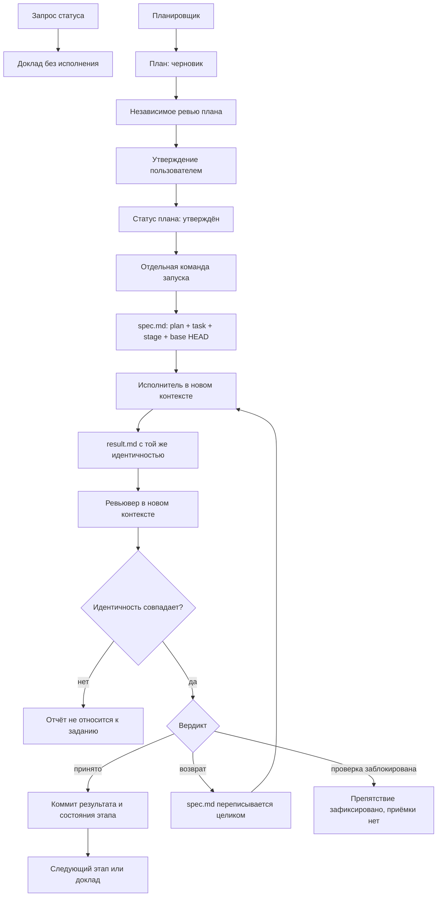

# AI-Orchestrated Workflow

Guideline and skills for running a coding plan with AI agent (Claude Code/Codex): one orchestrator session, one stage at a time, an independent review, and a single place where the plan state lives.

Планировщик готовит план как черновик, независимый ревьювер проверяет его, пользователь утверждает, а оркестратор фиксирует утверждение в состоянии плана. Запуск — отдельная команда. Оркестратор не исполняет этап сам: он выдаёт одно задание с точной связкой `plan → task → stage` и исходным `HEAD`; исполнитель работает в новом контексте, ревьювер независимо сверяет тот же этап и изменения от той же исходной точки. Принятый результат и состояние этапа фиксируются вместе. Постоянные материалы лежат в git, текущий рабочий контекст — в локальном `orchestrate_workflow/<имя-плана>/`.

## Зачем так

Длинная сессия агента теряет уже принятые решения, заводит вторую копию плана и принимает этап, который ревью вернуло. Этот комплект оставляет один протокол и четыре навыка с разными правами.

- Состояние этапа одно и находится в материале задачи под git; `00_summary.md` хранит только очередь и отдельный статус плана.
- Действующее задание одно: локальный `spec.md`. `spec.md`, `result.md`, `review.md` несут одинаковые `План`, `Задача`, `Этап` и исходный `HEAD`.
- Статус, утверждение и запуск — разные действия. Существенный пересмотр снова делает план черновиком.
- Один план одновременно ведёт одна orchestrator-сессия; другой вызов того же плана не пишет состояние параллельно.
- Посторонние файлы в каталогах workflow не получают значения по имени или расположению: они читаются только по явной ссылке.
- Возврат ревью нельзя превратить в приёмку, перенеся замечания на следующий этап.
- Отказ среды сообщается буквально и не подменяется новым запросом разрешения у пользователя.

## Как идёт сессия



Команда продолжения не открывает новые существенные решения. Их сначала показывают пользователю и записывают в материал задачи.

## Где лежит состояние

Общий корень workflow — `orchestrate_workflow/`. В нём находятся метод `method.md`, постоянные материалы планов в `plans/<имя-плана>/` и локальный каталог текущей сессии `<имя-плана>/`. Папка плана — источник подтверждённого состояния; каталог текущей сессии содержит только рабочий контекст выполнения. Другой путь допустим, только если его прямо задаёт контракт проекта.

| Что | Где | Git |
|---|---|---|
| Очередь и ссылки | `orchestrate_workflow/plans/<имя-плана>/00_summary.md` | да |
| Цель, решения, этапы, критерии, отметки версии и проверок | `orchestrate_workflow/plans/<имя-плана>/<задача>.md` | да |
| Привязка путей проекта | `orchestrate_workflow/method.md` | да |
| Задание текущего этапа | `orchestrate_workflow/<имя-плана>/spec.md` | нет |
| Отчёт исполнителя | `orchestrate_workflow/<имя-плана>/result.md` | нет |
| Ревью | `orchestrate_workflow/<имя-плана>/review.md` | нет |

Файлы выбираются по точному пути, а не по содержимому каталога. `00_summary.md` определяет task-файлы плана ссылками; дополнительные файлы в `orchestrate_workflow/plans/<имя-плана>/` не считаются задачами без такой ссылки. В каталоге текущей сессии протокольными являются только `spec.md`, `result.md`, `review.md`; другие файлы не считаются состоянием и читаются только по явной ссылке из текущего задания или протокола.

Очередь не копирует этапы. Каталог текущей сессии не служит вторым планом. Обязательные файлы обмена могут перезаписываться; при необходимости рядом с ними допускаются другие локальные артефакты текущей сессии. Утверждённое решение не остаётся только в чате или локальном каталоге. Форма отметок версии этапа и проверок — [runtimes.md](skills/orchestrate/references/runtimes.md).

Каталог текущей сессии не коммитится. Для конкретного плана его путь добавляется в локальный `.git/info/exclude`, например:

```text
/orchestrate_workflow/<имя-плана>/
```

Каталог `orchestrate_workflow/plans/` не исключается из git.

## Навыки

Четыре навыка. Каждый — отдельная роль со своим входом, чтением и записью.

**orchestrate.** Сессия оркестратора. Вызывается только явной командой с именем плана. Читает контракт, привязку и папку этого плана. Сверяет отметки этапов с git и с каталогом текущей сессии, включая обязательные `spec.md`, `result.md`, `review.md`. На статусном вызове докладывает состояние и останавливается. На запуске выдаёт один `spec.md` текущего этапа, принимает `result.md` и `review.md`, после вердикта обновляет отметку этапа в папке плана. Код этапа не пишет. Инструкции и папку плана правит сам; такая правка тоже проходит ревью. Модель сессии не подменяет.

**planner.** Планирование. Вызывается, когда плана ещё нет или его надо существенно пересмотреть. Создаёт папку плана и файлы задач, как описано ниже. Исполнителя не запускает, задание этапа не пишет. После записи план читает reviewer. Утверждает пользователь.

**implementer.** Исполнение одного этапа. Новый контекст на каждый вызов. Читает только текущий `spec.md`, контракт и источники, названные в задании. Меняет только перечисленные пути. Факты проверок пишет в `result.md`: команда, её код выхода, что подтверждено и что не запускалось. Не коммитит, не правит папку плана и не ставит отметку «принят».

**reviewer.** Независимая проверка. Новый контекст. Для плана сверяет папку плана с контрактом до утверждения. Для этапа сверяет результат с критериями и с отметкой «Готово», а не с пересказом исполнителя. Вердикт пишет в `review.md`: принято, возврат или проверка заблокирована. Критерий не ослабляет. Не коммитит и не переносит замечания в следующий этап.

Все четыре наследуют модель текущей сессии. Своя модель у навыка не задаётся. Над одним этапом работает один implementer. Следующий этап начинается после приёмки предыдущего.

Порядок ролей, приёмка и отказы среды — [protocol.md](skills/orchestrate/references/protocol.md). Формы файлов обмена — [templates.md](skills/orchestrate/references/templates.md).

## Планирование и файлы плана

Планирование делает planner до любого запуска. Имя плана выбирает пользователь. Под это имя создаётся одна папка.

1. `orchestrate_workflow/plans/<имя-плана>/00_summary.md` — статус плана и очередь. В нём плановая отметка `черновик`/`утверждён`, ссылка на открытую задачу, положение задач и датированные решения, общие для всего плана. Состояния этапов и результаты проверок сюда не копируются.
2. `orchestrate_workflow/plans/<имя-плана>/<задача>.md` — одна задача. В файле цель, решения по задаче, критерии и раздел «Этапы задачи». Этот раздел — единственное место отметок: номер и граница этапа, что должно быть готово, текущая версия этапа, именные проверки.

Новая задача добавляется новым файлом в ту же папку. Очередь получает ссылку на него. Закрытая задача остаётся по тому же пути, отдельный архив не создаётся. Локальный план, копии будущих заданий и второе состояние этапа не создаются.

Planner создаёт новый или существенно пересмотренный план со статусом `черновик`. Reviewer проверяет материал до утверждения. После явного утверждения пользователя orchestrator меняет в `00_summary.md` статус на `утверждён ГГГГ-ММ-ДД`. Утверждение и команда запуска — разные действия.

## Сессия по имени плана

Новая сессия открывается командой, в которой назван план. Данные о состоянии берутся из папки этого плана: очередь, затем материал открытой задачи и отметки версий этапов и проверок. Чат и пустой каталог текущей сессии состояние плана не заменяют. Если каталог сессии отсутствует, задача не считается неначатой.

В Claude Code команда начинается с `/orchestrate`, в Codex — с `$orchestrate`. Текст один.

Статус, без исполнения:

```text
/orchestrate Веди план <имя-плана> по orchestrate_workflow/plans/<имя-плана>/00_summary.md. Доложи подтверждённое состояние: репозиторий, открытая задача и отметки её этапов, следующая задача по очереди, открытые решения, расхождения папки плана с git и каталогом текущей сессии. Исполнение не запускай.
```

Запуск уже утверждённого плана и продолжение уже запущенного:

```text
/orchestrate Запусти утверждённый план <имя-плана> по orchestrate_workflow/plans/<имя-плана>/00_summary.md; разрешаю коммиты принятых этапов.
/orchestrate Продолжи запущенный план <имя-плана> по orchestrate_workflow/plans/<имя-плана>/00_summary.md.
```

Продолжение идёт только по ранее запущенным этапам. Orchestrate сначала сверяет отметку в папке плана с git и с `spec.md`, `result.md`, `review.md`. Старый отчёт другого этапа за результат нового задания не принимается. Восстановление оборванной сессии — [session-start.md](skills/orchestrate/references/session-start.md).

Неявный запуск выключен: навык не стартует сам.

## Установка

Общий комплект ставится один раз, чтобы проекты не хранили вторую копию протокола:

```bash
for skill in orchestrate planner implementer reviewer; do
  mkdir -p "$HOME/.agents/skills/$skill"
  cp "skills/$skill/SKILL.md" "$HOME/.agents/skills/$skill/SKILL.md"
done
mkdir -p ~/.agents/skills/orchestrate/references
cp -R skills/orchestrate/references/. ~/.agents/skills/orchestrate/references/
if [ ! -f ~/.agents/skills/orchestrate/agents/openai.yaml ]; then
  mkdir -p ~/.agents/skills/orchestrate/agents
  cp skills/orchestrate/agents/openai.yaml ~/.agents/skills/orchestrate/agents/openai.yaml
fi
```

Установка обновляет общий комплект, включая [шаблон метода](skills/orchestrate/references/method.md), но не создаёт проектные файлы. При обновлении сохраняются персональные настройки обнаружения навыков и наследования модели; локальные изменения сначала сверяются с устанавливаемым комплектом. Общие reference-файлы остаются в `~/.agents/skills/orchestrate/references/`.

При явно порученном подключении проекта orchestrate читает существующий `AGENTS.md` и создаёт только отсутствующую привязку `orchestrate_workflow/method.md` из общего шаблона. Существующие файлы не перезаписываются, конфликты сообщаются. Готовый метод от пользователя заранее не требуется. При запросе статуса или обсуждении файлы не создаются.

При подготовке конкретного плана planner создаёт его каталог, `00_summary.md` и материалы задач; пустая структура заранее не создаётся. Локальный каталог сессии и точное исключение создаёт orchestrate перед первым разрешённым вызовом этапа, файлы обмена — по действующему протоколу. Исполнитель и reviewer получают готовую привязку и точные пути, проект самостоятельно не подключают.

В проекте остаются контракт `AGENTS.md`, привязка путей `orchestrate_workflow/method.md` и определение четырёх навыков так, чтобы orchestrate, planner, implementer и reviewer читали этот комплект. Контракт описывает предметную область и проверки проекта. Этот репозиторий их не задаёт. При создании локального каталога текущей сессии его конкретный путь `/orchestrate_workflow/<имя-плана>/` добавляется в `.git/info/exclude`; `orchestrate_workflow/plans/` остаётся отслеживаемым.

## Что считается нарушением протокола

- Второе место, где записаны этапы или действующее задание.
- Запуск исполнения из статусного отчёта.
- Приёмка без ревью или с ослабленным критерием.
- Перенос замечаний возврата в следующий этап вместо исправления.
- Смена задания, пока исполнитель ещё работает.
- Своя модель у роли.
- Обход отказа среды правкой разрешений или повторным запуском той же команды в другой роли.
