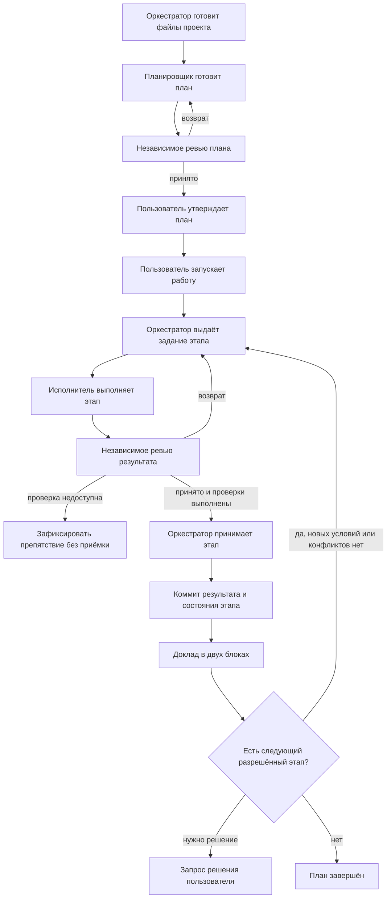

# AI-Orchestrated Workflow

Четыре навыка для ведения задач в Claude Code и Codex: подготовка плана, выполнение по одному этапу и независимое ревью. Репозиторий содержит устанавливаемые навыки и примеры файлов проекта.

## Установка

Скопируйте четыре каталога из `skills/` в `~/.agents/skills/`. На Windows из корня этого репозитория:

```powershell
$workflowSkillRoot = Join-Path $env:USERPROFILE '.agents/skills'
New-Item -ItemType Directory -Force -Path $workflowSkillRoot | Out-Null
foreach ($role in 'orchestrate', 'planner', 'implementer', 'reviewer') {
    Copy-Item -LiteralPath "skills/$role" -Destination $workflowSkillRoot -Recurse -Force
}
```

На macOS и Linux:

```sh
mkdir -p ~/.agents/skills
cp -R skills/orchestrate skills/planner skills/implementer skills/reviewer ~/.agents/skills/
```

При обновлении сначала сравните установленные файлы с исходниками и сохраните локальные изменения. В Git-проекте навыков хранится исходный комплект; чтобы пользоваться новой версией, обновите установленный комплект и начните новую сессию.

| Навык | Работа |
|---|---|
| `orchestrate` | Готовит файлы workflow проекта, ведёт план, выдаёт задания и принимает проверенные этапы. |
| `planner` | Готовит или пересматривает план; исполнение не запускает. |
| `implementer` | Выполняет один этап по текущему заданию. |
| `reviewer` | Независимо проверяет план, инструкции или результат этапа. |

## Создание плана

Откройте сессию в нужном проекте. В Codex используйте `$orchestrate`:

```text
$orchestrate Создай план <имя-плана>. Цель: <результат>. Исполнение не запускай.
```

Для первого подключения в Claude Code отправьте обычное текстовое поручение:

```text
Прочитай ~/.agents/skills/orchestrate/SKILL.md и действуй по нему. Создай план <имя-плана>. Цель: <результат>. Исполнение не запускай.
```

После подключения используйте `/orchestrate` вместо `$orchestrate` в командах ниже.

Навыки устанавливаются в общий профиль и используются в разных проектах. Протокол и референсы остаются в установленном комплекте. Оркестратор создаёт только требуемые для проекта файлы: одну привязку `orchestrate_workflow/method.md`, недостающий контракт и определения используемых ролей, материалы конкретного плана и текущий обмен. Каталог `orchestrate_workflow/references/` и копии метода в каталогах планов или сессий не создаются; повторное подключение не создаёт дублей.

Оркестратор сам создаёт отсутствующие каталоги и необходимые файлы по [правилам подключения](skills/orchestrate/references/project-files.md): контракт, привязку путей, определения ролей и локальный обмен. Существующие файлы читает и сохраняет; конфликтующие настройки согласует. Самостоятельно писать метод, заготовки ролей и папки пользователю не требуется.

Planner нужен для нового плана и существенного пересмотра цели, этапов, зависимостей, границ или критериев. Статус, восстановление и небольшие правки оркестратор выполняет сам. Пользователь задаёт работу в диалоге; нужные роли вызывает оркестратор. План проверяет reviewer, утверждает пользователь. Подготовка проекта и утверждение плана не запускают реализацию.

## Общая схема работы



Исполнитель и reviewer работают в отдельных контекстах с моделью текущей сессии. Оркестратор ведёт один этап за раз и сохраняет его исходную точку. Утверждение плана и запуск работы имеют разный смысл; их можно дать в одном ясном поручении после ревью. Запуск включает коммиты принятых этапов и переход между ними без повторных разрешений. Явные ограничения пользователя сохраняются; push разрешается отдельно.

## Ответ по итогу этапа

Два блока по [общей форме](skills/orchestrate/references/templates.md#ответ-пользователю-по-итогу-этапа):

1. «Как сейчас» → таблица `№ | что | как` → «Нужно ваше решение». В отчёте указаны состояние и коммит, изменения, проверки, непроверенное с причинами, риски и следующий этап. Когда решение не требуется, оркестратор пишет «Не требуется» и продолжает работу.
2. Вики-сводка в Textile: текущий результат и фактические проверки, без истории обсуждения.

## Как вести сессию

После положительного ревью подтвердите план обычной репликой в диалоге. Отдельная команда утверждения не нужна. Если в той же реплике явно разрешён запуск, повторять поручение не требуется.

Для запуска утверждённого плана:

```text
/orchestrate Запусти утверждённый план <имя-плана>. Push запрещён.
```

Для новой сессии или продолжения:

```text
/orchestrate Продолжи запущенный план <имя-плана>. Сначала сверь материал плана, git, задание, отчёт и ревью.
```

Для проверки плана без выполнения:

```text
/orchestrate Сводка плана <имя-плана>. Исполнение не запускай.
```

Оркестратор сверяет всё поручение с фактом до первого задания, сохраняет разрешения пользователя и выполненные операции. Затем выдаёт один `spec.md`; исполнитель приносит `result.md`, reviewer — `review.md`. Возврат исправляется в том же этапе. Ревью относится к точной версии файлов; после его проверки результат и приёмка фиксируются одним коммитом. После успешного коммита оркестратор докладывает итог и сразу продолжает следующий разрешённый этап. Вопросы задаются только при новых условиях или конфликтах, требующих решения пользователя. Отмена, ошибка или лимит оставляют явную точку восстановления.

| Что | Где в проекте |
|---|---|
| Пути и отклонения проекта | `orchestrate_workflow/method.md` |
| Статус, цель и очередь плана | `orchestrate_workflow/plans/<план>/00_summary.md` |
| Решения, этапы и их состояние | `orchestrate_workflow/plans/<план>/<задача>.md` |
| Текущие задание, отчёт и ревью | `orchestrate_workflow/<план>/spec.md`, `result.md`, `review.md` — локально, вне git |

Подробности находятся в навыках: [протокол](skills/orchestrate/references/protocol.md), [восстановление](skills/orchestrate/references/session-start.md), [шаблоны](skills/orchestrate/references/templates.md). Предметные правила и проверки задаёт контракт проекта. Каталог текущей сессии не служит второй копией плана.
