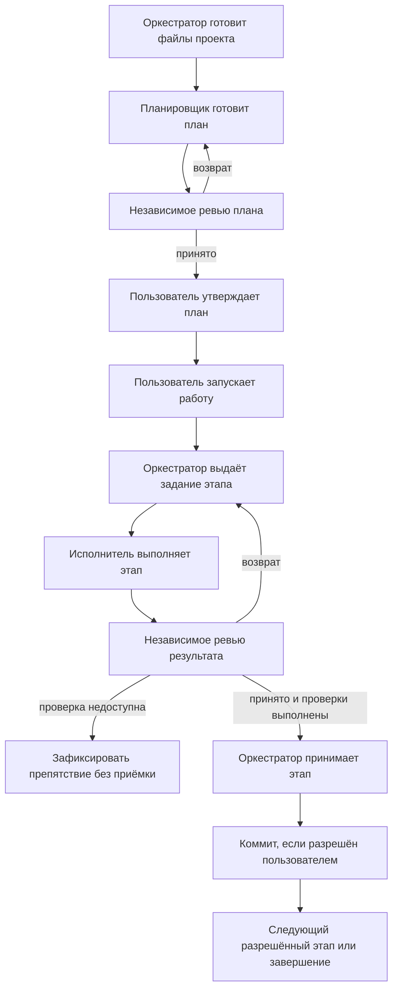

# AI-Orchestrated Workflow

Четыре навыка для ведения задач в Claude Code и Codex: подготовка плана, выполнение по одному этапу и независимое ревью. Репозиторий содержит устанавливаемые навыки и примеры файлов проекта.

## Установка

Скопируйте четыре каталога из `skills/` в `~/.agents/skills/`. На Windows из корня этого репозитория:

```powershell
$workflowSkillRoot = Join-Path $env:USERPROFILE '.agents/skills'
New-Item -ItemType Directory -Force -Path $workflowSkillRoot | Out-Null
foreach ($role in 'orchestrate', 'planner', 'implementer', 'reviewer') {
    Copy-Item -LiteralPath "skills/$role" -Destination $workflowSkillRoot -Recurse -Force
}
```

На macOS и Linux:

```sh
mkdir -p ~/.agents/skills
cp -R skills/orchestrate skills/planner skills/implementer skills/reviewer ~/.agents/skills/
```

При обновлении сначала сравните установленные файлы с исходниками и сохраните локальные изменения. В Git-проекте навыков хранится исходный комплект; чтобы пользоваться новой версией, обновите установленный комплект и начните новую сессию.

| Навык | Работа |
|---|---|
| `orchestrate` | Готовит файлы workflow проекта, ведёт план, выдаёт задания и принимает проверенные этапы. |
| `planner` | Готовит или пересматривает план; исполнение не запускает. |
| `implementer` | Выполняет один этап по текущему заданию. |
| `reviewer` | Независимо проверяет план, инструкции или результат этапа. |

## Начало работы

Откройте сессию в нужном проекте. В Codex используйте `$orchestrate`:

```text
$orchestrate Подготовь проект к оркестрации. План: <имя-плана>. Цель: <результат>.
```

Для первого подключения в Claude Code отправьте обычное текстовое поручение:

```text
Прочитай ~/.agents/skills/orchestrate/SKILL.md и действуй по нему. Подготовь проект к оркестрации. План: <имя-плана>. Цель: <результат>.
```

После подключения используйте `/orchestrate` вместо `$orchestrate` в командах ниже.

Навыки устанавливаются в общий профиль и используются в разных проектах. При первом рабочем запуске в сессии проекта оркестратор копирует документы процесса в `orchestrate_workflow/references/` под git. Проектные инструкции ссылаются только на документы внутри проекта. Обновление документов выполняется отдельным поручением после сравнения и ревью; обновление установленного комплекта не меняет проекты автоматически.

Оркестратор сам создаёт отсутствующие каталоги и необходимые файлы по [правилам подключения](skills/orchestrate/references/project-files.md): контракт, привязку путей, определения ролей и локальный обмен. Существующие файлы читает и сохраняет; конфликтующие настройки согласует. Самостоятельно писать метод, заготовки ролей и папки пользователю не требуется.

План готовит planner, проверяет reviewer, утверждает пользователь. Подготовка проекта и утверждение плана не запускают реализацию.

## Общая схема работы



Исполнитель и reviewer работают в отдельных контекстах с моделью текущей сессии. Оркестратор ведёт один этап за раз и сохраняет его исходную точку. Утверждение плана, запуск работы и разрешение на коммит — отдельные действия пользователя.

## Как вести сессию

Статус, без выполнения:

```text
$orchestrate Веди план <имя-плана>. Доложи подтверждённое состояние. Исполнение не запускай.
```

После ревью и утверждения плана:

```text
$orchestrate Запусти утверждённый план <имя-плана>; разрешаю коммиты принятых этапов. Push запрещён.
```

Для новой сессии или продолжения:

```text
$orchestrate Продолжи запущенный план <имя-плана>. Сначала сверь материал плана, git, задание, отчёт и ревью.
```

Оркестратор сверяет всё поручение с фактом до первого задания, сохраняет разрешения пользователя и выполненные операции. Затем выдаёт один `spec.md`; исполнитель приносит `result.md`, reviewer — `review.md`. Возврат исправляется в том же этапе. Ревью относится к точной версии файлов; после его проверки результат и приёмка фиксируются вместе, если коммит разрешён. Отмена, ошибка или лимит оставляют явную точку восстановления, а не повод повторить операции.

| Что | Где в проекте |
|---|---|
| Пути и отклонения проекта | `orchestrate_workflow/method.md` |
| Статус, цель и очередь плана | `orchestrate_workflow/plans/<план>/00_summary.md` |
| Решения, этапы и их состояние | `orchestrate_workflow/plans/<план>/<задача>.md` |
| Текущие задание, отчёт и ревью | `orchestrate_workflow/<план>/spec.md`, `result.md`, `review.md` — локально, вне git |

Подробности находятся в навыках: [протокол](skills/orchestrate/references/protocol.md), [восстановление](skills/orchestrate/references/session-start.md), [шаблоны](skills/orchestrate/references/templates.md). Предметные правила и проверки задаёт контракт проекта. Каталог текущей сессии не служит второй копией плана.
